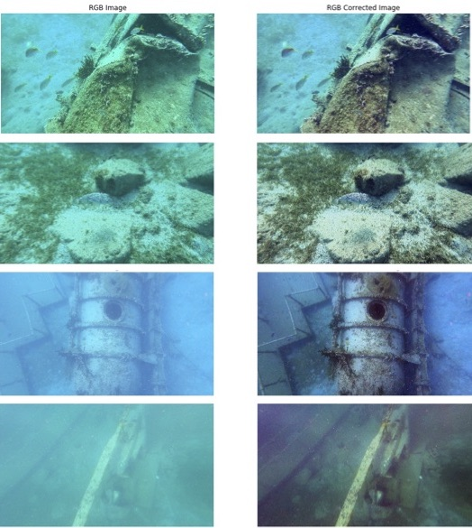

# Underwater colour correction

In this project, we studied, implemented and tested an underwater colour correction method from Bianco et al. (2015).

Further information can be found [here]("Projet_Imagerie_Num_rique_anonymous.pdf).

G. Bianco, M. Muzzupappa, F. Bruno, R. Garcia, and L. Neu-mann. a new color correction method for underwater imaging.ISPRS - International Archives of the Photogrammetry, Re-mote Sensing and Spatial Information Sciences, XL55, April2015
